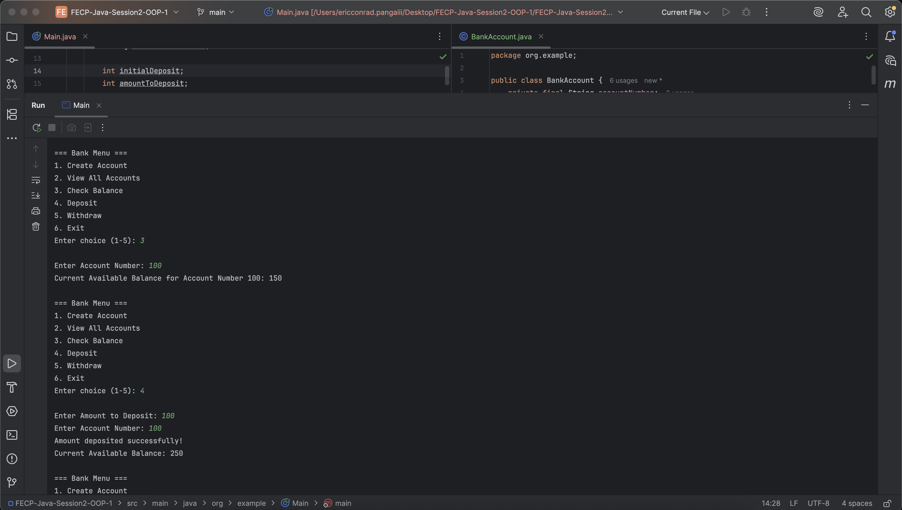
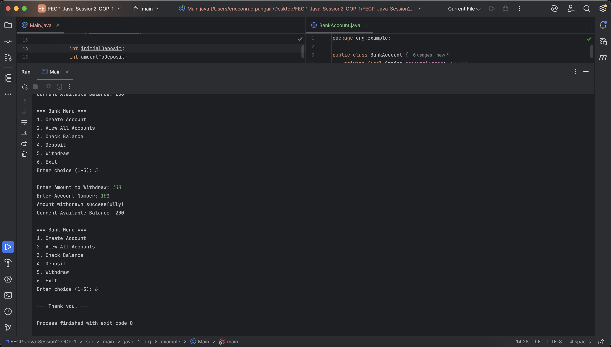

# FECP-Java-Session2-OOP-1

## Lab 1: Build a Java Bank Account System

## Eric Conrad Panga

## Screenshots of Output

### Create Account

### View All Accounts

### Check Balance

### Deposit

### Withdraw

### Exit

